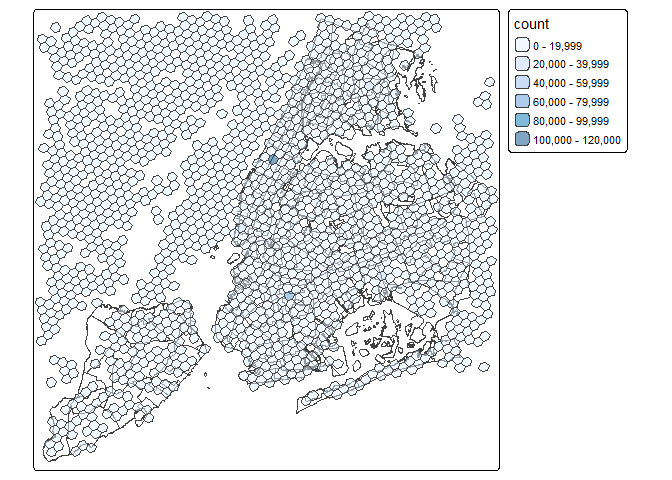

Data exploration
================
Ashe King
2026-02-26

``` r
# read in data and store in data table
nycDataSept <- fread(file = "C:/Users/KingA/Senesitive data/twitter_na_2017-09_ny.csv.gz")
```

``` r
# explore data
head(nycDataSept)
```

    ##                    id      u_id          created_at            home       lon
    ##                 <i64>     <i64>              <POSc>          <char>     <num>
    ## 1: 912808555081817984 138559840 2017-09-26 22:38:13 8a2a100d22affff -73.94878
    ## 2: 912808579010359040  52556618 2017-09-26 22:38:19 8a2a1008c317fff -74.01912
    ## 3: 913550092904402944  14266637 2017-09-28 23:44:49 8a2aa84ec12ffff -73.96854
    ## 4: 913550105856429952 314326954 2017-09-28 23:44:52 8a2a100f34f7fff -73.96854
    ## 5: 912808598308139008  33972107 2017-09-26 22:38:23 8a2a1072c66ffff -73.98482
    ## 6: 905959916673884032  14369376 2017-09-08 01:04:10 8a2a10728947fff -73.96854
    ##         lat   type
    ##       <num> <char>
    ## 1: 40.65514      p
    ## 2: 40.76125      p
    ## 3: 40.78071      p
    ## 4: 40.78071      p
    ## 5: 40.72879     ll
    ## 6: 40.78071      p
    ##                                                                                                                      text
    ##                                                                                                                    <char>
    ## 1:                                                                                     🤦🏼‍♂️🤦🏼‍♂️🤦🏼‍♂️🆒 https://t.co/cTWGMBDjTU
    ## 2:     💙Thank you for correcting my heart and teaching me everyday to love without restrictions 💙 https://t.co/UMEee3rbdc
    ## 3: These Welfare Queens always tryin to get the government to pay for their private jets and shit https://t.co/IILVKYlk6k
    ## 4:                                                               Again..  why would you NOT lift? https://t.co/eN2e4O02sM
    ## 5:                                                          Drew Blood! #justgladtobehere @ Pinks https://t.co/z9RtZMZaqx
    ## 6:                                                                                                       In typical fashi

``` r
#Cutting off first 100 rows
sub_nyc_data <- slice_head(nycDataSept, n = 10000)
# Extracting useful data and converting it into a simple feature
sf_nyc_data <- sub_nyc_data %>% 
  select(id, u_id, home, lon, lat) %>% 
  st_as_sf(coords = c("lon", "lat"), crs = 4326)
# plotting the frist 100 posts
ggplot() +
  geom_sf(data = sf_nyc_data["u_id"])
```

<!-- -->

``` r
# Setting up basemap
nynta <- read_sf(here("analysis/data/raw_data/nynta2020_25d/nynta2020.shp"))
nynta_proj <- st_transform(nynta, crs = 6347)
#creating a buffer so these is less edges being left out of h3 grid
nynta_buffer <- nynta_proj["BoroName"] %>% 
  st_buffer(dist = 100)
#Creating H3 gridmap
grid_map <-nynta_buffer %>%
  polygon_to_cells(res = h3_res) %>% 
  cell_to_polygon(simple = T)
```

    ## Data has been transformed to EPSG:4326.

``` r
# ploting h3 map over basemap
tm_shape(nynta_proj["BoroName"])+
  tm_borders()+
  tm_shape(grid_map)+
  tm_polygons(alpha = 0.5)
```

    ## 

    ## ── tmap v3 code detected ───────────────────────────────────────────────────────

    ## [v3->v4] `tm_polygons()`: use `fill_alpha` instead of `alpha`.

<!-- -->

``` r
#Creating the interaction matrix for the h3 Cells
#get the h3 Cell names
grid_map_index <- nynta_buffer %>% 
  polygon_to_cells(, res = h3_res)
```

    ## Data has been transformed to EPSG:4326.

``` r
current_index = 0
#unpack it from the weird list the h3 function outputs
keys <- unlist(grid_map_index)
# create a list of length 2 for martix names, using the h3 cell names as indexes for the matrix
key_list <- list(keys, keys)
# Building martix with cell filled with integer 0 ~1400 col & rows
h3_interaction_matrix <- matrix(data = 0, nrow = length(keys), ncol = length(keys), dimnames = key_list)
```

``` r
#messing around with the september twitter data to population the matrix

#getting list of unique user IDs
user_ids <- nycDataSept$u_id %>% 
  unique()

#Create a h3 cell index on nyc data
h3_nyc_data <- nycDataSept %>% 
  mutate(h3_cell = latLngToCell(lat = lat, lng = lon, resolution = h3_res)) %>% 
  select(u_id, home, h3_cell)

#selecting user post data where the user posted more than 10 times and less than 200 during study period
h3_nyc_data_slim <- h3_nyc_data %>% 
  group_by(u_id) %>% 
  filter(n() > 10 && n() < 200) %>%
  ungroup()

# converting h3 cells to multipolygons
h3_nyc_data_slim %>% 
  group_by(u_id) %>% 
  pull(h3_cell) %>% 
  cells_to_multipolygon()
```

    ## Geometry set for 1 feature 
    ## Geometry type: MULTIPOLYGON
    ## Dimension:     XY
    ## Bounding box:  xmin: -74.26574 ymin: 40.50056 xmax: -73.69027 ymax: 40.92204
    ## Geodetic CRS:  WGS 84

    ## MULTIPOLYGON (((-74.26216 40.89917, -74.26411 4...

``` r
#creating cell counts data frame
counted_cells <- h3_nyc_data_slim %>% 
  group_by(h3_cell) %>% 
  mutate(count = n()) %>%
  select(h3_cell, count) %>%
  ungroup() %>% 
  distinct(h3_cell, count) %>%
  mutate(geometry = cell_to_polygon(h3_cell)) %>% 
  st_sf()

#plotting post heatmap
#TODO use the local dataset 
#TODO Use Jenks or Quantile distribution for the map fill
tm_shape(nynta["BoroName"])+
  tm_borders()+
  tm_shape(counted_cells)+
  tm_polygons(fill = "count", fill_alpha = .5)
```

<!-- -->
