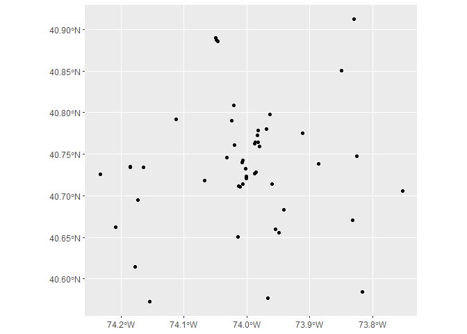
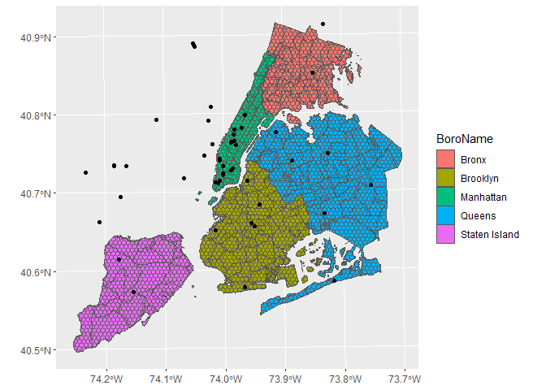

Data exploration
================
Ashe King
2026-02-26

``` r
# read in data and store in data table
nycDataSept <- fread(file = "C:/Users/KingA/Senesitive data/twitter_na_2017-09_ny.csv.gz")
```

``` r
# explore data
head(nycDataSept)
```

    ##                    id      u_id          created_at            home       lon
    ##                 <i64>     <i64>              <POSc>          <char>     <num>
    ## 1: 912808555081817984 138559840 2017-09-26 22:38:13 8a2a100d22affff -73.94878
    ## 2: 912808579010359040  52556618 2017-09-26 22:38:19 8a2a1008c317fff -74.01912
    ## 3: 913550092904402944  14266637 2017-09-28 23:44:49 8a2aa84ec12ffff -73.96854
    ## 4: 913550105856429952 314326954 2017-09-28 23:44:52 8a2a100f34f7fff -73.96854
    ## 5: 912808598308139008  33972107 2017-09-26 22:38:23 8a2a1072c66ffff -73.98482
    ## 6: 905959916673884032  14369376 2017-09-08 01:04:10 8a2a10728947fff -73.96854
    ##         lat   type
    ##       <num> <char>
    ## 1: 40.65514      p
    ## 2: 40.76125      p
    ## 3: 40.78071      p
    ## 4: 40.78071      p
    ## 5: 40.72879     ll
    ## 6: 40.78071      p
    ##                                                                                                                      text
    ##                                                                                                                    <char>
    ## 1:                                                                                     🤦🏼‍♂️🤦🏼‍♂️🤦🏼‍♂️🆒 https://t.co/cTWGMBDjTU
    ## 2:     💙Thank you for correcting my heart and teaching me everyday to love without restrictions 💙 https://t.co/UMEee3rbdc
    ## 3: These Welfare Queens always tryin to get the government to pay for their private jets and shit https://t.co/IILVKYlk6k
    ## 4:                                                               Again..  why would you NOT lift? https://t.co/eN2e4O02sM
    ## 5:                                                          Drew Blood! #justgladtobehere @ Pinks https://t.co/z9RtZMZaqx
    ## 6:                                                                                                       In typical fashi

``` r
#Cutting off first 100 rows
sub_nyc_data <- slice_head(nycDataSept, n = 100)
# Extracting useful data and converting it into a simple feature
sf_nyc_data <- sub_nyc_data %>% 
  select(id, u_id, home, lon, lat) %>% 
  st_as_sf(coords = c("lon", "lat"), crs = 4326)
# plotting the frist 100 posts
ggplot() +
  geom_sf(data = sf_nyc_data["u_id"])
```

<!-- -->

``` r
# Setting up basemap
nynta <- read_sf(here("project_data/nynta2020_25d/nynta2020.shp"))
nynta_proj <- st_transform(nynta, crs = 6347)
grid_map <- nynta_proj %>% 
  st_make_grid(cellsize = 600, square = F, crs = st_crs(nynta_proj))
# created a 600m cell size grid to overlay the map
grid_map <- st_intersection(grid_map, nynta_proj)
# cut down the grid to only include grid cells that intersect the NYC boundaries
ggplot()+
  geom_sf(data = nynta_proj["BoroName"], aes(fill = BoroName))+
  geom_sf(data = grid_map, fill = NA)+
  geom_sf(data = sf_nyc_data)
```

<!-- -->
