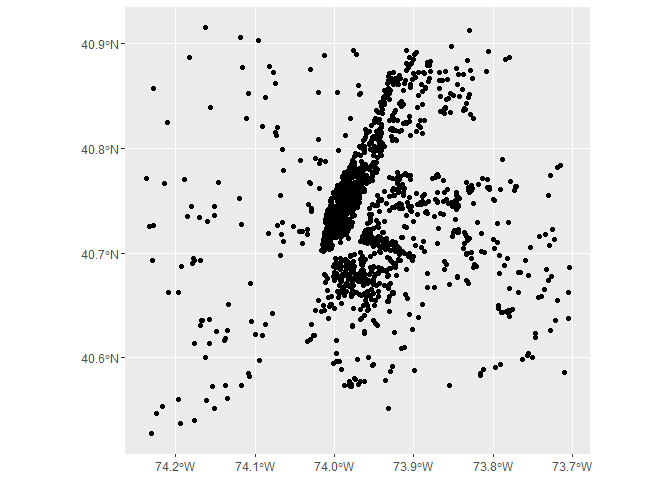
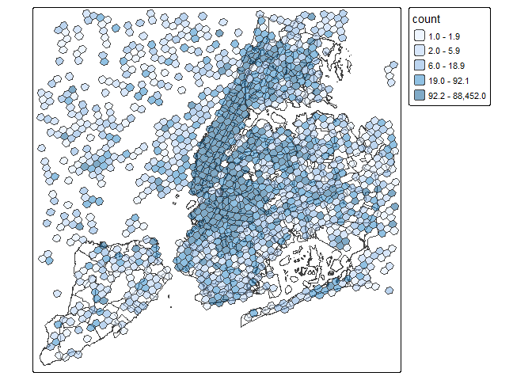
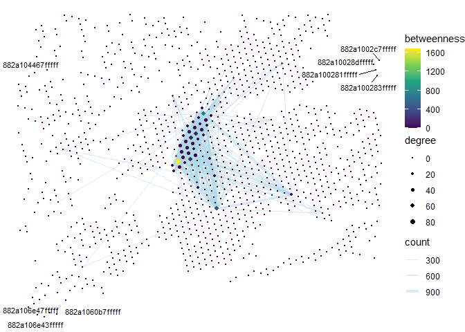

Data exploration
================
Ashe King
2026-02-26

``` r
# read in data and store in data table
#nycDataSept <- fread(file = "C:/Users/KingA/Senesitive data/twitter_na_2017-09_ny.csv.gz")
nycDataSept <- fread(here("analysis/data/derived_data/twitter_with_locality.csv"))
nycDataSept <- nycDataSept %>% filter(is_local == T)
```

``` r
#Cutting off first 100 rows
sub_nyc_data <- slice_head(nycDataSept, n = 10000)
# Extracting useful data and converting it into a simple feature
sf_nyc_data <- sub_nyc_data %>% 
  select(id, u_id, home, lon, lat) %>% 
  st_as_sf(coords = c("lon", "lat"), crs = 4326)
# plotting the frist 100 posts
ggplot() +
  geom_sf(data = sf_nyc_data["u_id"])
```

<!-- -->

``` r
# Setting up basemap
nynta <- read_sf(here("analysis/data/raw_data/nynta2020_25d/nynta2020.shp"))
nynta_proj <- st_transform(nynta, crs = 6347)
#creating a buffer so these is less edges being left out of h3 grid
nynta_buffer <- nynta_proj["BoroName"] %>% 
  st_buffer(dist = 100)
#Creating H3 gridmap
grid_map <-nynta_buffer %>%
  polygon_to_cells(res = h3_res) %>% 
  cell_to_polygon(simple = T)
```

    ## Data has been transformed to EPSG:4326.

``` r
# ploting h3 map over basemap
tm_shape(nynta_proj["BoroName"])+
  tm_borders()+
  tm_shape(grid_map)+
  tm_polygons(alpha = 0.5)
```

    ## 

    ## ── tmap v3 code detected ───────────────────────────────────────────────────────

    ## [v3->v4] `tm_polygons()`: use `fill_alpha` instead of `alpha`.

<!-- -->

``` r
#Creating the interaction matrix for the h3 Cells
#get the h3 Cell names
grid_map_index <- nynta_buffer %>% 
  polygon_to_cells(, res = h3_res)
```

    ## Data has been transformed to EPSG:4326.

``` r
current_index = 0
#unpack it from the weird list the h3 function outputs
keys <- unlist(grid_map_index)
# create a list of length 2 for martix names, using the h3 cell names as indexes for the matrix
key_list <- list(keys, keys)
# Building martix with cell filled with integer 0 ~1400 col & rows
h3_interaction_matrix <- matrix(data = 0, nrow = length(keys), ncol = length(keys), dimnames = key_list)
```

``` r
#messing around with the september twitter data to population the matrix

#getting list of unique user IDs
user_ids <- nycDataSept$u_id %>% 
  unique()

#Create a h3 cell index on nyc data
h3_nyc_data <- nycDataSept %>% 
  mutate(h3_cell = latLngToCell(lat = lat, lng = lon, resolution = h3_res)) %>% 
  select(u_id, home, h3_cell)

#selecting user post data where the user posted more than 10 times and less than 200 during study period
h3_nyc_data_slim <- h3_nyc_data %>% 
  group_by(u_id) %>% 
  filter(n() > 60 && n() < 200) %>%
  ungroup()

# converting h3 cells to multipolygons
h3_nyc_data_slim %>% 
  group_by(u_id) %>% 
  pull(h3_cell) %>% 
  cells_to_multipolygon()
```

    ## Geometry set for 1 feature 
    ## Geometry type: MULTIPOLYGON
    ## Dimension:     XY
    ## Bounding box:  xmin: -74.26159 ymin: 40.50143 xmax: -73.69145 ymax: 40.92119
    ## Geodetic CRS:  WGS 84

    ## MULTIPOLYGON (((-74.10315 40.64012, -74.10951 4...

``` r
#creating cell counts data frame
counted_cells <- h3_nyc_data_slim %>% 
  group_by(h3_cell) %>% 
  mutate(count = n()) %>%
  select(h3_cell, count) %>%
  ungroup() %>% 
  distinct(h3_cell, count) %>%
  mutate(geometry = cell_to_polygon(h3_cell)) %>% 
  st_sf()

#plotting post heatmap
#TODO use the local dataset 
tm_shape(nynta["BoroName"])+
  tm_borders()+
  tm_shape(counted_cells)+
  tm_polygons(fill = "count", 
              fill.scale = tm_scale_intervals(n=5, 
                                              style = 'quantile'),
              fill_alpha = .5)
```

<!-- -->

``` r
#finding the number of unique cells that each user posted in throughout the day
cells_visited <- h3_nyc_data_slim %>% 
  group_by(u_id) %>% 
  distinct(h3_cell, .keep_all = T) %>% 
  mutate(n_cells_visted = n()) %>% ungroup()

#Summarizing the stats of the # of unique cells visited
cells_visited %>% 
  distinct(u_id, .keep_all = T) %>% 
  summarize(avg_num_cell_visted = mean(n_cells_visted),
            max = max(n_cells_visted), 
            min = min(n_cells_visted),
            median = median(n_cells_visted))
```

    ## # A tibble: 1 × 4
    ##   avg_num_cell_visted   max   min median
    ##                 <dbl> <int> <int>  <int>
    ## 1                10.0    69     1      7

``` r
h3_nyc_data_slim
```

    ## # A tibble: 368,454 × 3
    ##          u_id home            h3_cell        
    ##         <dbl> <chr>           <chr>          
    ##  1  138559840 8a2a100d22affff 882a107665fffff
    ##  2  314326954 8a2a100f34f7fff 882a100895fffff
    ##  3  443188522 8a2a107292e7fff 882a107665fffff
    ##  4 2595156171 8a2a100db5b7fff 882a107665fffff
    ##  5  167649402 8a2a100aa807fff 882a100895fffff
    ##  6  156426927 8a2a1005a28ffff 882a100895fffff
    ##  7   61429473 8a2a1075422ffff 882a1072c7fffff
    ##  8   34280840 8a2a1072c057fff 882a1072c1fffff
    ##  9    6492922 8a2a103a642ffff 882a100e3bfffff
    ## 10   23729800 8a2a100f374ffff 882a100cd1fffff
    ## # ℹ 368,444 more rows

``` r
# Making node table
nodes <- h3_nyc_data_slim %>% 
  select(cell_name = h3_cell) %>% 
  mutate(lat = cellToLatLng(cell_name)$lat, lon = cellToLatLng(cell_name)$lng) %>% 
  distinct(cell_name, .keep_all = T)

# simple feature nodes
# sf_nodes <- nodes %>%
#   mutate(geometry = st_centroid(cell_to_polygon(cell_name)))

# Making edge table
edges <- h3_nyc_data_slim %>% 
  group_by(u_id) %>% 
  expand(from = h3_cell, to = h3_cell) %>% #create a to/from col using combination of cells grouped by user id
  ungroup() %>% 
  select(from, to) %>% # the resulting DF had over 1mil rows with plently of duplicates
  group_by(from, to) %>% 
  mutate(count = n()) %>% # creating count by grouping by distinct from/to pairs
  ungroup() %>% 
  distinct(.keep_all = T) %>% # getting rid of duplicate rows
  filter(from != to) %>%  # removing rows where from node == to node
  mutate(key1 = pmin(to, from), # creating temp key cols to remove flipped duplicate rows
         key2 = pmax(to, from)) %>%
  distinct(key1, key2, .keep_all = TRUE) %>%   # keeping only unique key combinations
  select(-key1, -key2)   # removing the temporary key columns

#filter edges to only contain edges with a count greater than n
edges <- edges %>% 
  filter(count >= 50)

# simple feature edges
# sf_edges <- edges %>%
#   rowwise() %>%
#   mutate(
#     geometry = st_sfc(
#       st_linestring(
#         rbind(
#           st_coordinates(cell_to_point(from)),
#           st_coordinates(cell_to_point(to))
#         )
#       )
#     )
#   ) %>%
#   st_as_sf()


# Making Graph
graph <- tbl_graph(nodes = nodes, edges = edges, directed = F)
graph <-  graph %>%
  activate(nodes) %>%
  mutate(degree = centrality_degree(),
         betweenness = centrality_betweenness())

graph
```

    ## # A tbl_graph: 1240 nodes and 737 edges
    ## #
    ## # An undirected simple graph with 1149 components
    ## #
    ## # Node Data: 1,240 × 5 (active)
    ##    cell_name         lat   lon degree betweenness
    ##    <chr>           <dbl> <dbl>  <dbl>       <dbl>
    ##  1 882a107665fffff  40.7 -73.9     58       411. 
    ##  2 882a100895fffff  40.8 -74.0     65       709. 
    ##  3 882a1072c7fffff  40.7 -74.0     83      1687. 
    ##  4 882a1072c1fffff  40.7 -74.0     41        33.0
    ##  5 882a100e3bfffff  40.7 -73.8      0         0  
    ##  6 882a100cd1fffff  40.7 -73.8     21        13.7
    ##  7 882a107057fffff  40.7 -74.1      2         0  
    ##  8 882a100dedfffff  40.7 -74.0     14         0  
    ##  9 882a107411fffff  40.6 -74.0      0         0  
    ## 10 882a10088bfffff  40.8 -74.0      0         0  
    ## # ℹ 1,230 more rows
    ## #
    ## # Edge Data: 737 × 3
    ##    from    to count
    ##   <int> <int> <int>
    ## 1     2    20   381
    ## 2     6    20   173
    ## 3     1    20   194
    ## # ℹ 734 more rows

``` r
# Plot graph
  ggraph(graph, x = lon, y = lat, layout = 'manual') +
  geom_edge_link(aes(width = count), alpha = 0.5, color = 'lightblue')+
  geom_node_point(aes(size = degree, color = betweenness)) + 
  scale_size(range = c(0.1, 2))+
  geom_node_text(aes(label = cell_name), size = 3, repel =T) +
  scale_edge_width(range = c(0.1, 2))+
  scale_color_viridis_c() +
  theme_void()
```

<!-- -->
