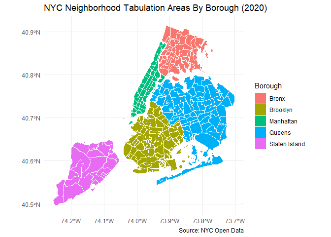

Basemap for NYC
================
James McQuilkin
2026-04-30

\#Load Packages

\#Generate Basic Choropleth Map Colored by Borough

``` r
# Import the shapefile, transform to NYC State Plane
nynta <- read_sf(here("data/raw_data/mapping_data/nynta2020_25d/nynta2020.shp")) %>% 
  st_transform(2263)

#Plot map
ggplot(data = nynta) +
  geom_sf(aes(fill = BoroName), color = "white", size = 0.1) +
  labs(
    title = "NYC Neighborhood Tabulation Areas By Borough (2020)",
    fill = "Borough",
    caption = "Source: NYC Open Data"
  ) +
  theme_minimal()
```

<!-- -->
