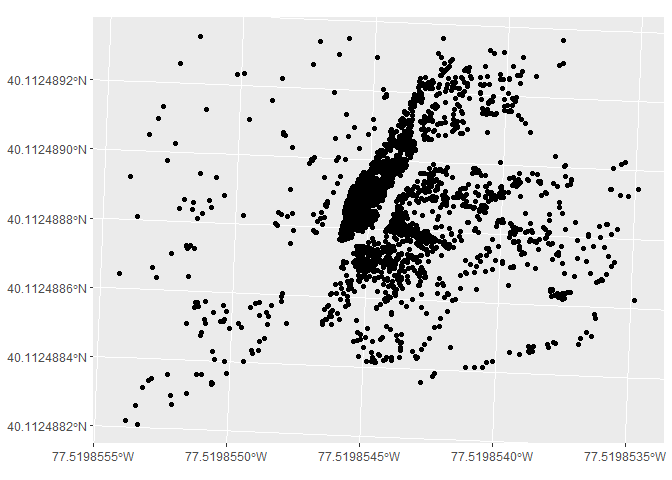
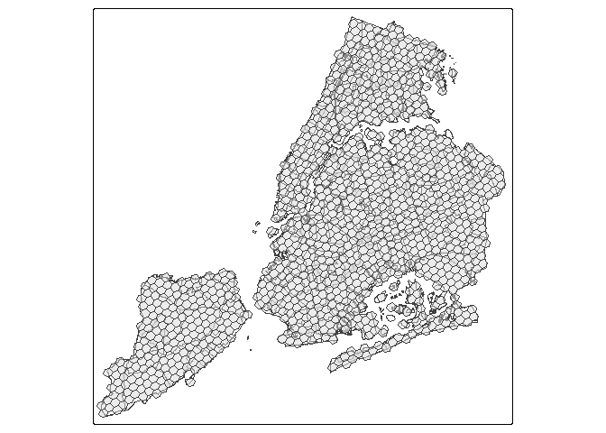
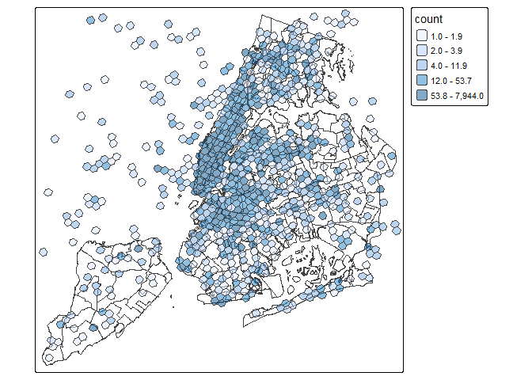
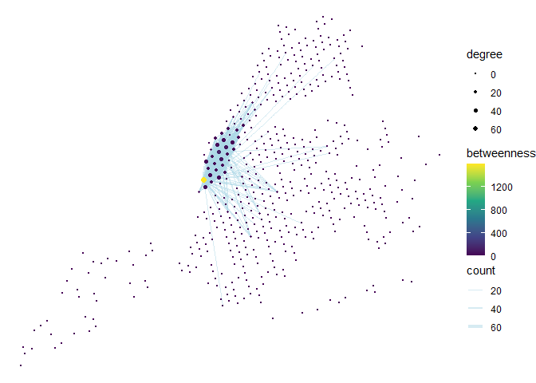

Data exploration
================
Ashe King
2026-02-26

``` r
# read in data and store in data table
nycDataSept <- fread(here(here("data/derived_data/user_data/twitter_data_user_origin_2017-09.csv")))
nycDataSept <- nycDataSept %>% filter(is_local == T)
```

``` r
#Cutting off first 100 rows
sub_nyc_data <- slice_head(nycDataSept, n = 10000)
# Extracting useful data and converting it into a simple feature
sf_nyc_data <- sub_nyc_data %>% 
  select(id, u_id, home, lon, lat) %>% 
  st_as_sf(coords = c("lon", "lat"), crs = crs)
# plotting the frist 100 posts
ggplot() +
  geom_sf(data = sf_nyc_data["u_id"])
```

<!-- -->

``` r
# Setting up basemap
nynta <- read_sf(here("data/raw_data/mapping_data/nynta2020_25d/nynta2020.shp"))
nynta_proj <- st_transform(nynta, crs = crs)
#creating a buffer so these is less edges being left out of h3 grid
nynta_buffer <- nynta_proj["BoroName"] %>% 
  st_buffer(dist = 100)
#Creating H3 gridmap
grid_map <-nynta_buffer %>%
  polygon_to_cells(res = h3_res) %>% 
  cell_to_polygon(simple = T)
```

    ## Data has been transformed to EPSG:4326.

``` r
# ploting h3 map over basemap
tm_shape(nynta_proj["BoroName"])+
  tm_borders()+
  tm_shape(grid_map)+
  tm_polygons(alpha = 0.5)
```

    ## 

    ## ── tmap v3 code detected ───────────────────────────────────────────────────────

    ## [v3->v4] `tm_polygons()`: use `fill_alpha` instead of `alpha`.

<!-- -->

``` r
#Creating the interaction matrix for the h3 Cells
#get the h3 Cell names
grid_map_index <- nynta_buffer %>% 
  polygon_to_cells(, res = h3_res)
```

    ## Data has been transformed to EPSG:4326.

``` r
current_index = 0
#unpack it from the weird list the h3 function outputs
keys <- unlist(grid_map_index)
# create a list of length 2 for martix names, using the h3 cell names as indexes for the matrix
key_list <- list(keys, keys)
# Building martix with cell filled with integer 0 ~1400 col & rows
h3_interaction_matrix <- matrix(data = 0, nrow = length(keys), ncol = length(keys), dimnames = key_list)
```

``` r
#messing around with the september twitter data to population the matrix

#getting list of unique user IDs
user_ids <- nycDataSept$u_id %>% 
  unique()

#Create a h3 cell index on nyc data
h3_nyc_data <- nycDataSept %>% 
  mutate(h3_cell = latLngToCell(lat = lat, lng = lon, resolution = h3_res)) %>% 
  select(u_id, home, h3_cell)

#selecting user post data where the user posted more than 10 times and less than 200 during study period
h3_nyc_data_slim <- h3_nyc_data %>% 
  group_by(u_id) %>% 
  filter(n() > 60 && n() < 200) %>%
  ungroup()

# converting h3 cells to multipolygons
h3_nyc_data_slim %>% 
  group_by(u_id) %>% 
  pull(h3_cell) %>% 
  cells_to_multipolygon()
```

    ## Geometry set for 1 feature 
    ## Geometry type: MULTIPOLYGON
    ## Dimension:     XY
    ## Bounding box:  xmin: -74.26075 ymin: 40.50056 xmax: -73.69381 ymax: 40.92119
    ## Geodetic CRS:  WGS 84

    ## MULTIPOLYGON (((-73.88759 40.70056, -73.88122 4...

``` r
#creating cell counts data frame
counted_cells <- h3_nyc_data_slim %>% 
  group_by(h3_cell) %>% 
  mutate(count = n()) %>%
  select(h3_cell, count) %>%
  ungroup() %>% 
  distinct(h3_cell, count) %>%
  mutate(geometry = cell_to_polygon(h3_cell)) %>% 
  st_sf()

#plotting post heatmap
tm_shape(nynta["BoroName"])+
  tm_borders()+
  tm_shape(counted_cells)+
  tm_polygons(fill = "count", 
              fill.scale = tm_scale_intervals(n=5, 
                                              style = 'quantile'),
              fill_alpha = .5)
```

<!-- -->

``` r
#finding the number of unique cells that each user posted in throughout the day
cells_visited <- h3_nyc_data_slim %>% 
  group_by(u_id) %>% 
  distinct(h3_cell, .keep_all = T) %>% 
  mutate(n_cells_visted = n()) %>% ungroup()

#Summarizing the stats of the # of unique cells visited
cells_visited %>% 
  distinct(u_id, .keep_all = T) %>% 
  summarize(avg_num_cell_visted = mean(n_cells_visted),
            max = max(n_cells_visted), 
            min = min(n_cells_visted),
            median = median(n_cells_visted))
```

    ## # A tibble: 1 × 4
    ##   avg_num_cell_visted   max   min median
    ##                 <dbl> <int> <int>  <int>
    ## 1                12.0    47     1     11

``` r
h3_nyc_data_slim
```

    ## # A tibble: 35,148 × 3
    ##          u_id home            h3_cell        
    ##       <int64> <chr>           <chr>          
    ##  1  106963663 8a2a100e016ffff 882a1072cdfffff
    ##  2   26435030 8a2a100de32ffff 882a100c6bfffff
    ##  3   61429473 8a2a1075422ffff 882a1072c7fffff
    ##  4   34280840 8a2a1072c057fff 882a1072c1fffff
    ##  5   22320796 8a2a100f0687fff 882a100f07fffff
    ##  6 2893486973 8a2a100dc19ffff 882a107259fffff
    ##  7 3192129959 8a2a1077581ffff 882a1072c3fffff
    ##  8   41022908 8a2a1072c66ffff 882a100a19fffff
    ##  9  249895454 8a2a100d002ffff 882a100d01fffff
    ## 10   30672215 8a2a100d359ffff 882a100d35fffff
    ## # ℹ 35,138 more rows

``` r
# Filtering visited nodes
h3_nyc_data_slim <- h3_nyc_data_slim %>% 
  mutate(geometry = cell_to_point(h3_cell)) %>% 
  st_as_sf() %>%
  st_transform(crs=crs) %>% 
  st_intersection(nynta_proj["BoroName"])
```

    ## Warning: attribute variables are assumed to be spatially constant throughout
    ## all geometries

``` r
# Making node table
nodes <- h3_nyc_data_slim %>% 
  select(cell_name = h3_cell) %>% 
  mutate(lat = cellToLatLng(cell_name)$lat, lon = cellToLatLng(cell_name)$lng) %>% 
  distinct(cell_name, .keep_all = T)

# simple feature nodes
# sf_nodes <- nodes %>%
#   mutate(geometry = st_centroid(cell_to_polygon(cell_name)))

# Making edge table
edges <- h3_nyc_data_slim %>% 
  group_by(u_id) %>% 
  expand(from = h3_cell, to = h3_cell) %>% #create a to/from col using combination of cells grouped by user id
  ungroup() %>% 
  select(from, to) %>% # the resulting DF had over 1mil rows with plently of duplicates
  group_by(from, to) %>% 
  mutate(count = n()) %>% # creating count by grouping by distinct from/to pairs
  ungroup() %>% 
  distinct(.keep_all = T) %>% # getting rid of duplicate rows
  filter(from != to) %>%  # removing rows where from node == to node
  mutate(key1 = pmin(to, from), # creating temp key cols to remove flipped duplicate rows
         key2 = pmax(to, from)) %>%
  distinct(key1, key2, .keep_all = TRUE) %>%   # keeping only unique key combinations
  select(-key1, -key2)   # removing the temporary key columns

#filter edges to only contain edges with a count greater than n
edges <- edges %>% 
  filter(count >= 10)

# simple feature edges
# sf_edges <- edges %>%
#   rowwise() %>%
#   mutate(
#     geometry = st_sfc(
#       st_linestring(
#         rbind(
#           st_coordinates(cell_to_point(from)),
#           st_coordinates(cell_to_point(to))
#         )
#       )
#     )
#   ) %>%
#   st_as_sf()


# Making Graph
graph <- tbl_graph(nodes = nodes, edges = edges, directed = F)
graph <-  graph %>%
  activate(nodes) %>%
  mutate(degree = centrality_degree(),
         betweenness = centrality_betweenness())

graph
```

    ## # A tbl_graph: 520 nodes and 383 edges
    ## #
    ## # An undirected simple graph with 451 components
    ## #
    ## # Node Data: 520 × 6 (active)
    ##    cell_name                       geometry   lat   lon degree betweenness
    ##    <chr>           <POINT [US_survey_foot]> <dbl> <dbl>  <dbl>       <dbl>
    ##  1 882a100d15fffff        (997348 204153.2)  40.7 -74.0      0           0
    ##  2 882a100d03fffff      (996669.7 207017.9)  40.7 -74.0      0           0
    ##  3 882a100d1dfffff      (999659.8 206161.7)  40.7 -73.9      0           0
    ##  4 882a100d11fffff       (1000338 203297.1)  40.7 -73.9      0           0
    ##  5 882a100de5fffff      (993403.4 197272.5)  40.7 -74.0      0           0
    ##  6 882a100d17fffff      (998026.3 201288.7)  40.7 -74.0      0           0
    ##  7 882a100d3bfffff      (995036.4 202144.8)  40.7 -74.0      4           0
    ##  8 882a100dedfffff      (995714.8 199280.5)  40.7 -74.0      2           0
    ##  9 882a100de1fffff      (996393.1 196416.6)  40.7 -74.0      0           0
    ## 10 882a100dc5fffff       (1001694 197568.6)  40.7 -73.9      3           0
    ## # ℹ 510 more rows
    ## #
    ## # Edge Data: 383 × 3
    ##    from    to count
    ##   <int> <int> <int>
    ## 1   190   252    15
    ## 2   252   305    29
    ## 3   252   337    11
    ## # ℹ 380 more rows

``` r
# Plot graph
  ggraph(graph, x = lon, y = lat, layout = 'manual') +
  geom_edge_link(aes(width = count), alpha = 0.5, color = 'lightblue')+
  geom_node_point(aes(size = degree, color = betweenness)) + 
  scale_size(range = c(0.1, 2))+
 # geom_node_text(aes(label = cell_name), size = 3, repel =T) +
  scale_edge_width(range = c(0.1, 2))+
  scale_color_viridis_c() +
  theme_void()
```

<!-- -->
