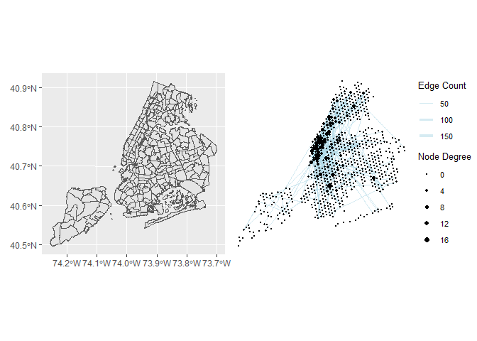

base_graph
================
Ashe King

# Data transformation

``` r
#Create a h3 cell index on nyc data
h3_nyc_data <- nycDataSept %>% 
  mutate(h3_cell = latLngToCell(lat = lat, lng = lon, resolution = h3_res), home = get_parent(home, res = h3_res)) %>% 
  select(u_id, home, h3_cell)

# filter data to only include NYC data
h3_nyc_data <- h3_nyc_data %>% 
  mutate(geometry = cell_to_point(h3_cell)) %>% 
  st_as_sf() %>%
  st_transform(crs=crs) %>% 
  st_intersection(nynta_proj["BoroName"])

#Save geom
h3_geom <- h3_nyc_data %>% 
  select(h3_cell, geometry)

#Drop Geom for speed
h3_nyc_data <- h3_nyc_data %>% 
  st_drop_geometry()

#selecting user post data where the user posted more than 10 times and less than 200 during study period
h3_nyc_data_slim <- h3_nyc_data %>% 
  group_by(u_id) %>% 
  filter(n() > min_posts && n() < max_posts) %>%
  ungroup() %>% 
  filter(h3_cell != home) # Fitler where posts are made in the User's home region

#Creating a list of a cells(nodes) in the data to use as a basis for the node data frame
all_cells <- h3_nyc_data_slim %>% 
  pivot_longer(cols = c(home, h3_cell)) %>% 
  select(cell_name = value) %>% 
  distinct(cell_name)

# Making node table
nodes <- all_cells %>%
  mutate(lat = cellToLatLng(cell_name)$lat, lon = cellToLatLng(cell_name)$lng) %>% 
  distinct(cell_name, .keep_all = T) %>% 
  filter(cell_name != "882a1072c7fffff")

# Making edge table (depreciated: Creates transit web for user between their posts)
# edges <- h3_nyc_data_slim %>% 
#   group_by(u_id) %>% 
#   expand(from = h3_cell, to = h3_cell) %>% #create a to/from col using combination of cells grouped by user id
#   ungroup() %>% 
#   select(from, to) %>% # the resulting DF had over 1mil rows with plently of duplicates
#   group_by(from, to) %>% 
#   mutate(count = n()) %>% # creating count by grouping by distinct from/to pairs
#   ungroup() %>% 
#   distinct(.keep_all = T) %>% # getting rid of duplicate rows
#   filter(from != to) %>%  # removing rows where from node == to node
#   mutate(key1 = pmin(to, from), # creating temp key cols to remove flipped duplicate rows
#          key2 = pmax(to, from)) %>%
#   distinct(key1, key2, .keep_all = TRUE) %>%   # keeping only unique key combinations
#   select(-key1, -key2)   # removing the temporary key columns

# Create Edges (Maps travel between user 'home' and other posted locations)
edges <- h3_nyc_data_slim %>% 
  group_by(home, h3_cell) %>% 
  mutate(count = n()) %>% 
  ungroup() %>% 
  distinct(.keep_all = T)%>%  # removing rows where from node == to node
  mutate(key1 = pmin(home, h3_cell), # creating temp key cols to remove flipped duplicate rows
         key2 = pmax(home, h3_cell)) %>%
  distinct(key1, key2, .keep_all = TRUE) %>%   # keeping only unique key combinations
  select(-key1, -key2)

#filter edges to only contain edges with a count greater than n
edges <- edges %>% 
  filter(count >= min_edges) %>% 
  filter(home != "882a1072c7fffff" & h3_cell != "882a1072c7fffff") %>% 
  rename(from = home, to = h3_cell)

#Outputs for edge and node csv files, uncomment to write to disk
# nodes %>% write_csv(file = here("data/derived_data/nodes_and_edge_data/nodes"))
# edges %>% write_csv(file = here("data/derived_data/nodes_and_edge_data/edges"))

# Making Graph
graph <- tbl_graph(nodes = nodes, edges = edges, directed = T)
graph <-  graph %>%
  activate(nodes) %>%
  mutate(degree = centrality_degree(),
         betweenness = centrality_betweenness())
```

``` r
# Cleaned visualization - James
basemap <- ggplot(nynta_proj) +
  geom_sf()

vis_1  <- ggraph(graph, x = lon, y = lat, layout = 'manual') +
  geom_edge_link(aes(width = count), alpha = 0.5, color = "lightblue") +
  geom_node_point(aes(size = degree)) + 
  scale_size(range = c(0.1, 2), name = "Node Degree") +
  scale_edge_width(range = c(0.1, 2), name = "Edge Count") +
  theme_void() +
  theme(
    plot.title = element_text(size = 16, face = "bold", hjust = 0.5),
    legend.position = "right",
    legend.title = element_text(size = 10),
    legend.text = element_text(size = 8),
    plot.background = element_rect(fill = "white")
  )

plot(basemap + vis_1)
```

<!-- -->

\#Solo network graph visualization

``` r
plot(vis_1 + labs(title = "NYC Network Visualization"))
```

-1.png)<!-- -->

``` r
#ggsave(filename = here("analysis/3_Create_Nodal_Graph/Network_map.png"), plot = vis_1 + labs(title = "Network Visualization Over Basemap"), dpi = 600)
```
