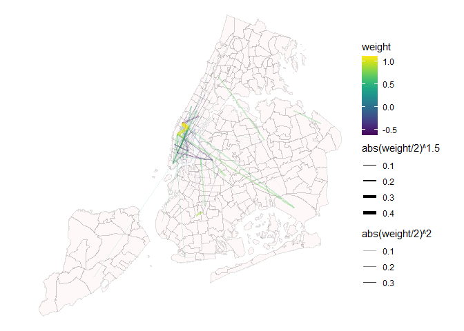

Gravity Model
================
Daniel Meyer
2026-05-01

``` r
#Load and dissolve NYC boundary
nyc_outline <- read_sf(here("data/raw_data/mapping_data/nynta2020_25d/nynta2020.shp")) %>%
  st_make_valid() %>%
  st_union() %>%
  st_transform(2263)
  #EPSG 2263 is NYC State Plane

nynta <- read_sf(here("data/raw_data/mapping_data/nynta2020_25d/nynta2020.shp"))
nynta_proj <- st_transform(nynta, crs = 4326)
```

``` r
# Load twitter data and filter by type to get exact coordinates
twitter_path <- "C:/Users/ldmey/Downloads/469_proj_data/twitter_na_2017-09_ny.csv"
df <- fread(twitter_path) %>%
  filter(type == "ll")
  # Type ll contains exact lat long while type p is more approximate
```

``` r
# Create a lookup for unique home H3 cells
home_lookup <- df %>%
  distinct(home) %>%
  mutate(geometry = h3jsr::cell_to_point(home)) %>% 
  st_as_sf() %>% 
  st_transform(st_crs(nyc_outline))

# Determine if cells are inside NYC
home_lookup <- home_lookup %>%
  mutate(is_local = as.logical(st_intersects(geometry, nyc_outline, sparse = FALSE))) %>%
  st_drop_geometry()

# Merge results and label
df_final <- df %>%
  left_join(home_lookup, by = "home") %>%
  mutate(user_type = if_else(is_local, "local", "non-local"))

# Select only posts by local users
nycDataSept <- df_final %>% filter(is_local == T)
```

``` r
# Operating on n rows
sub_nyc_data <- slice_head(nycDataSept, n = 50000)

# Extracting necessary data and converting it into a simple feature
sf_nyc_data <- sub_nyc_data %>% 
  select(id, u_id, home, lon, lat) %>% 
  st_as_sf(coords = c("lon", "lat"), crs = 4326)
```

``` r
# Create table with number of posts by user
posts_table = sf_nyc_data$u_id |>
  table()

# Create weights column in sf object
#    This column stores the fraction of the user's posts that a single post represents:
#     ie if the user has 20 posts, the weight value would be .05
#    This normalization prevents users with many posts from drowning out the
#     data from users who post less frequently.
sf_nyc_data = sf_nyc_data |>
  mutate(weight = 1/posts_table[as.character(u_id)])
```

``` r
# Join the dataframe to neighborhoods based on post location and user location
sf_nyc_data = sf_nyc_data |>
  st_join(nynta_proj, join = st_within) |>
  mutate(geometry_user = h3jsr::cell_to_point(home)) |>
  st_set_geometry("geometry_user") |>
  st_join(nynta_proj, join=st_within, suffix = c("_post", "_user")) |>
  select(c(id, u_id, home, weight,
           geometry, geometry_user,
           BoroName_post, NTAName_post, BoroName_user, NTAName_user)) |>
  st_set_geometry("geometry")

# Calculate weighted post totals by neighborhood...
post_neighborhoods_norm = sf_nyc_data |>
  group_by(NTAName_post) |>
  summarize(sum = sum(weight), .groups = "drop") |>
  st_drop_geometry()
  # ...and store in a basic data frame

# Repeat for weighted user totals
colnames(post_neighborhoods_norm)[1] = "NTAName"
user_neighborhoods_norm = sf_nyc_data |>
  group_by(NTAName_user) |>
  summarize(sum = sum(weight), .groups = "drop") |>
  st_drop_geometry()
colnames(user_neighborhoods_norm)[1] = "NTAName"

# Join post and user totals to the neighborhood sf object
nynta_proj = nynta_proj |>
  left_join(post_neighborhoods_norm, 
            by="NTAName")
nynta_proj = nynta_proj |>
  left_join(user_neighborhoods_norm, 
            by="NTAName", suffix = c("_to", "_from"))
nynta_proj = nynta_proj |>
  mutate(sum_diff = sum_to - sum_from)
```

``` r
# Creating edge data frame
joint_neighborhoods_norm = sf_nyc_data |>
  group_by(NTAName_post, NTAName_user) |>
  summarize(sum = sum(weight), .groups = "drop") |>
  select(from = NTAName_user, to = NTAName_post, weight = sum) |>
  filter(
    
    !is.na(to),                         # Exclude edges to or from locations outside
                                        #    the neighborhoods
    weight >= 2,                        # Minimum weighted count of posts for a
                                        #    a neighborhood to be considered
    to != from,                         # Exclude posts in the same neighborhood as
                                        #    the user's home
    from != "Tribeca-Civic Center",     # Exclude posts by users to and from a
    to != "Tribeca-Civic Center"        #    suspiciously over-represented neighborhood
    
    ) |>
  filter(
    from != "Bedford-Stuyvesant (East)" | to != "Bedford-Stuyvesant (West)"
  ) |>
  st_drop_geometry()

# Creating node data frame
nynta_points = nynta_proj |> st_centroid() |>
  select(NTAName)
```

    ## Warning: st_centroid assumes attributes are constant over geometries

``` r
nynta_points = nynta_points |>
  mutate(
    x = st_coordinates(nynta_points)[,"X"],
    y = st_coordinates(nynta_points)[,"Y"]
  ) |>
  st_drop_geometry()
```

``` r
joint_neighborhoods_norm = joint_neighborhoods_norm |>
  left_join(user_neighborhoods_norm, by = c("from" = "NTAName"))
names(joint_neighborhoods_norm)[names(joint_neighborhoods_norm) == "sum"] = "users_from"

joint_neighborhoods_norm = joint_neighborhoods_norm |>
  left_join(user_neighborhoods_norm, by = c("to" = "NTAName"))
names(joint_neighborhoods_norm)[names(joint_neighborhoods_norm) == "sum"] = "users_to"
```

``` r
distance_matrix = nynta_proj |>
  st_centroid() |>
  st_distance()
```

    ## Warning: st_centroid assumes attributes are constant over geometries

``` r
neighborhood_index_list = as.list(1:nrow(nynta_points)) |>
  setNames(nynta_points$NTAName)

joint_neighborhoods_norm = joint_neighborhoods_norm |>
  mutate(distance_m = 0)
for (n in 1:nrow(joint_neighborhoods_norm)) {
  joint_neighborhoods_norm[n,"distance_m"] = as.double(distance_matrix[
    neighborhood_index_list[[ as.character(joint_neighborhoods_norm[n,"from"]) ]],
    neighborhood_index_list[[ as.character(joint_neighborhoods_norm[n,"to"]) ]]
  ])
}

joint_neighborhoods_norm = joint_neighborhoods_norm |>
  filter(!is.na(users_to))
```

``` r
ols = lm( log(weight) ~ log(users_from) + log(users_to) + log(distance_m),
        data = joint_neighborhoods_norm)
joint_neighborhoods_norm$weight = ols$residuals
```

``` r
# Making the graph
graph <- tbl_graph(nodes = nynta_points, edges = joint_neighborhoods_norm, directed = T)
graph <-  graph %>%
  activate(nodes) %>%
  mutate(degree = centrality_degree(),
         betweenness = centrality_betweenness())

# Plot graph
  ggraph(graph, x = x, y = y, layout = 'manual') +
  geom_sf(data = nynta_proj, inherit.aes = F, fill = "#feeded67", color = "#22222222") +
  geom_edge_link(aes(alpha = abs(weight/2)^2, width = abs(weight/2)^1.5, color = weight))+
  scale_edge_color_viridis(guide = guide_edge_colorbar()) +
  scale_edge_width(range = c(0, 2))+
  scale_edge_alpha(range = c(0, .8))+
  theme_void()
```

<!-- -->
