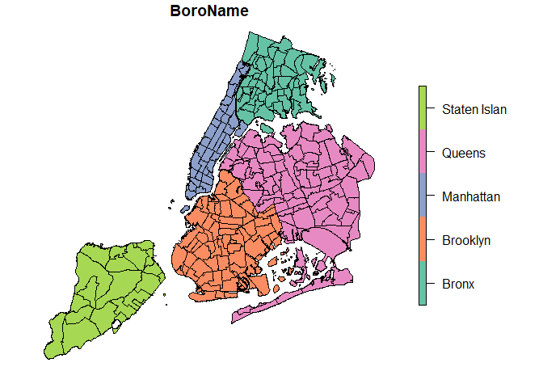
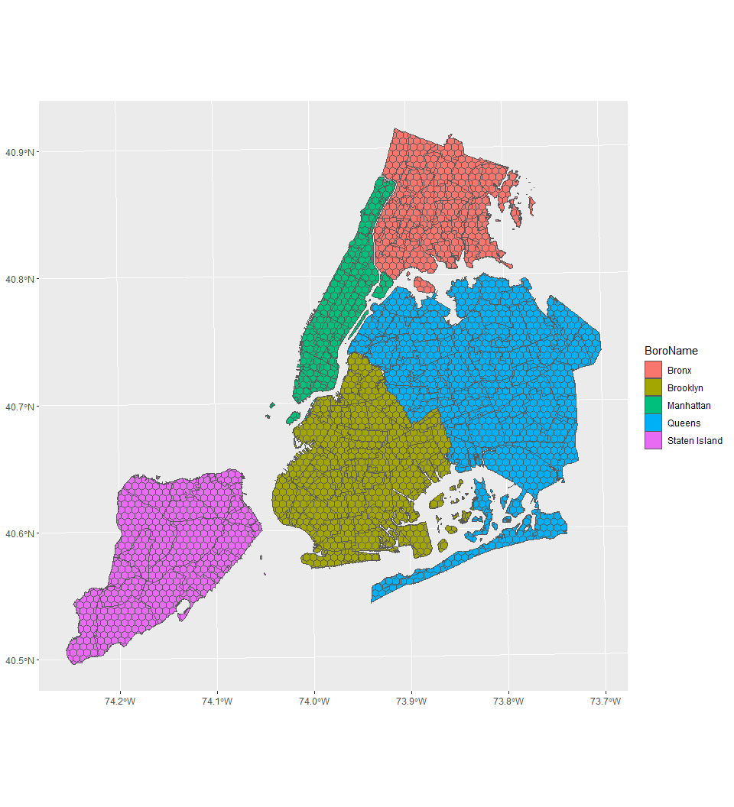

NYC Basemap
================
James McQuilkin & Ashe King
2026-02-24

## Plotting 2020 Neighborhood Tabulation Areas NYC

``` r
nynta <- read_sf(here("project_data/nynta2020_25d/nynta2020.shp"))
plot(nynta["BoroName"], key.width = lcm(4.06))
```

<!-- --> \## crs and
Projection testing

``` r
# Projecting to UTM 18N, the length unit has changed to meters
nynta_proj <- st_transform(nynta, crs = 6347)
#plot(nynta_proj["BoroName"])
```

## Creating a theoretical grid for analysis

``` r
grid_map <- nynta_proj %>% 
  st_make_grid(cellsize = 600, square = F, crs = st_crs(nynta_proj))
# created a 600m cell size grid to overlay the map
grid_map <- st_intersection(grid_map, nynta_proj)
# cut down the grid to only include grid cells that intersect the NYC boundaries
ggplot() + 
  geom_sf(data = nynta_proj["BoroName"], aes(fill = BoroName)) + 
  geom_sf(data = grid_map, fill = NA)
```

<!-- -->

``` r
#mapping both layers onto the same graph
```
